# Xianyu Auto Reply Admin

基于 Ant Design 与 FastAPI 的多平台管理后台，用于集中管理闲鱼账户、浏览器环境、代理、会话消息、商品、订单及 Chatwoot 消息同步。

本文档按照“部署 → 验证 → 配置 → 使用 → 运维”的顺序编排。正式环境优先使用 `开始部署.sh`；已有 PostgreSQL、Redis 或需要自定义部署时，可使用手动 Docker Compose 方案。

## 功能预览

### 会话消息

集中查看多个平台账户的客户消息、商品信息和会话状态。

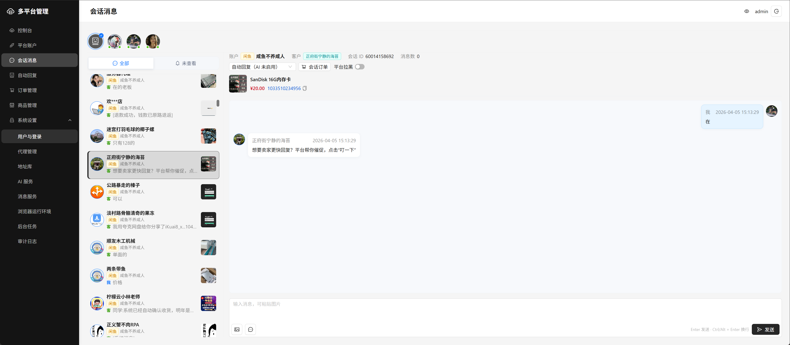

### 平台账户

统一管理账户、Cookie、代理环境、在线状态和业务开关。

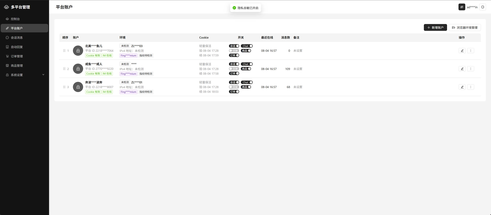

### Chatwoot 消息同步

将平台会话同步到 Chatwoot，支持桌面端和移动端处理消息。

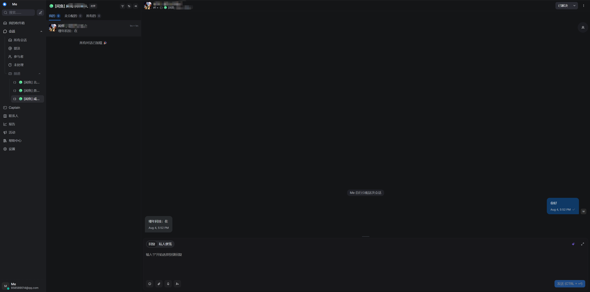

### VNC 浏览器会话

使用账户独立的 Cookie、代理、Profile 和指纹环境进行在线操作及人工验证。

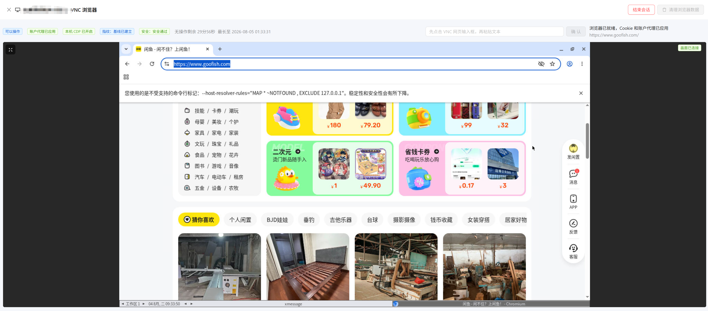

## 目录

- [功能预览](#功能预览)
- [1. 项目概览](#1-项目概览)
- [2. 部署前准备](#2-部署前准备)
- [3. 使用开始部署sh部署](#3-使用开始部署sh部署)
- [4. 手动部署](#4-手动部署)
- [5. 本地开发与测试](#5-本地开发与测试)
- [6. 部署后验证](#6-部署后验证)
- [7. 系统初始化与功能配置](#7-系统初始化与功能配置)
- [8. 功能使用](#8-功能使用)
- [9. 项目状态与当前目标](#9-项目状态与当前目标)
- [10. 配置与发布说明](#10-配置与发布说明)
- [11. 运维说明](#11-运维说明)
- [12. 常见问题](#12-常见问题)

## 1. 项目概览

### 1.1 主要能力

- 多后台用户与分级权限
- 多闲鱼账户及 WSS 长连接管理
- 闲鱼扫码登录与 Cookie 管理
- 账户级 `socks5/socks5h` 代理隔离
- Fingerprint Chromium 指纹浏览器
- 账户级 Profile 与 VNC 在线操作
- 会话消息聚合及自动回复
- 商品、订单与后台任务管理
- Chatwoot 多端双向消息同步
- 审计日志及登录来源 IP 识别

### 1.2 安全与隔离原则

- 代理按账户绑定，闲鱼接口、VNC 和浏览器操作统一走账户代理。
- 只支持 `socks5/socks5h`，代理失败时不允许直连兜底。
- VNC 启动时自动注入 Cookie，关闭时自动提取并同步 Cookie。
- 指纹浏览器、VNC 与 HTTP 操作保持账户指纹一致。
- IM 风险状态不自动重试，由单浏览器环境和内嵌 noVNC 人工处理。
- CDP 调试端口只允许本机访问。

## 2. 部署前准备

### 2.1 部署方式

| 场景 | 推荐方式 |
| --- | --- |
| 首次完整部署 | `开始部署.sh` |
| 使用完整依赖栈升级 | `开始部署.sh` |
| 已有外部 PostgreSQL、Redis | 手动 Docker Compose |
| 本地开发和调试 | `npm run dev` / `npm run dev:hot` |

### 2.2 正式部署环境

- Linux `amd64`
- Docker 与 Docker Compose
- 足够存放项目镜像、依赖镜像和持久化数据的磁盘空间
- 可用的后台域名或服务器访问地址
- 如需 HTTPS，提前准备证书或确定证书签发方案
- 如选择在线依赖，服务器需要能够拉取官方镜像

在线依赖镜像统一拉取 `linux/amd64`。离线环境需要提前准备 Chatwoot、Redis、PostgreSQL/pgvector 等官方镜像归档。

### 2.3 一键部署文件

从 `main` 流水线取得以下四个文件，并放在同一目录：

```text
开始部署.sh
compose.all.yml
xianyu-admin-<版本>-linux-amd64.docker.tar.gz
xianyu-admin-<版本>-linux-amd64.docker.tar.gz.sha256
```

项目镜像包同时用于首次部署和后续升级。Chatwoot、Redis 与 pgvector 不包含在项目镜像包中，可在部署时选择在线拉取或导入离线归档。

### 2.4 建议目录结构

```text
部署目录/
├── README.md
├── 开始部署.sh
├── compose.all.yml
├── xianyu-admin-<版本>-linux-amd64.docker.tar.gz
├── xianyu-admin-<版本>-linux-amd64.docker.tar.gz.sha256
├── XIANYU_DATA/
└── images/
```

`XIANYU_DATA` 由部署脚本在同级目录中管理，用于固定保存数据、密钥、证书和配置；升级不会覆盖这些内容。

## 3. 使用 `开始部署.sh` 部署

`开始部署.sh` 是完整部署和升级的首选入口。

### 3.1 赋予执行权限

```bash
cd /path/to/deployment
chmod +x ./开始部署.sh
```

### 3.2 部署前检查

```bash
./开始部署.sh --doctor
```

`--doctor` 用于检查 Docker 平台、项目镜像、依赖镜像及当前部署进度。正式执行前应先处理检查结果中的错误。

### 3.3 开始或继续部署

```bash
./开始部署.sh
```

按照脚本菜单选择“开始/继续部署”。如果部署中断，再次选择该选项即可复用已经完成的阶段。

部署过程中需要确认：

1. 项目镜像包和 SHA-256 校验结果。
2. 在线拉取或离线导入官方依赖镜像。
3. 闲鱼后台外部端口。
4. Chatwoot 外部端口。
5. 公开访问 URL。
6. HTTPS 及证书方案。
7. 数据目录、密钥和持久化配置。

默认建议闲鱼后台使用 `6161`，Chatwoot 使用 `6443`；最终端口和公开 HTTPS 地址以部署过程中的确认为准。

### 3.4 完整部署架构

完整部署固定运行 5 个常驻容器：

1. 闲鱼应用
2. Chatwoot Rails
3. Chatwoot Sidekiq
4. 共享 PostgreSQL
5. 共享 Redis

数据库、Redis、API 等内部服务不发布宿主机端口。

### 3.5 部署成功标志

- 镜像校验和导入成功。
- 5 个常驻容器均处于正常状态。
- 闲鱼后台和 Chatwoot 能通过最终确认的 URL 访问。
- `XIANYU_DATA` 中已生成持久化配置、密钥和证书数据。
- 日志中没有持续出现的数据库、Redis、API 或 WebSocket 连接错误。

完成后继续执行第 6 章的部署验证。

## 4. 手动部署

本节适用于已有外部 PostgreSQL、Redis，只需要启动一个项目容器的场景。

### 4.1 准备外部服务

确认 PostgreSQL 与 Redis 可以从项目容器访问，并准备两条连接地址：

- `XIANYU_DATABASE_URL`
- `XIANYU_REDIS_URL`

### 4.2 创建私有配置

```bash
cp .env.docker.example .env.docker
```

编辑 `.env.docker`，只需要人工填写 `XIANYU_DATABASE_URL` 和 `XIANYU_REDIS_URL`。实际私有配置已经加入 `.gitignore`，不要提交到代码仓库。

### 4.3 登录镜像仓库

```bash
docker login 192.168.2.5:5050
```

如镜像仓库地址发生变化，应使用流水线或项目交付信息提供的实际地址。

### 4.4 拉取并启动项目容器

```bash
docker compose --env-file .env.docker pull
docker compose --env-file .env.docker up -d --wait --remove-orphans
```

该方式使用 `compose.yml`，只运行项目容器并连接外部 PostgreSQL、Redis。

### 4.5 检查运行状态

```bash
docker compose --env-file .env.docker ps
docker compose --env-file .env.docker logs --tail=200
```

容器健康后，按照第 6 章检查后台、浏览器、代理、平台登录和业务链路。

## 5. 本地开发与测试

本地开发继续使用源码启动，不经过 Docker。

### 5.1 实测启动

```bash
npm run dev
```

首次运行会从 `.env.example` 创建私有的 `.env.local` 并自动生成 JWT 密钥。只需填写外部 PostgreSQL、Redis 两条连接地址；源码模式仍兼容已有 MySQL。

`npm run dev` 会执行完整实测链路：

1. 检查数据库。
2. 构建 Ant Design 管理后台。
3. 启动 FastAPI。
4. 启动 worker。
5. 在 `9001` 端口启动后台预览。

### 5.2 热更新开发

```bash
npm run dev:hot
```

### 5.3 后端回归测试

```bash
npm test
```

## 6. 部署后验证

按顺序检查，某一步失败时先处理当前问题，再继续下一步。

1. 闲鱼管理后台能够正常打开并登录。
2. Chatwoot 能够打开并进入收件箱。
3. 数据库、Redis 和 worker 没有持续报错。
4. 浏览器运行环境显示为“可用”。
5. 代理节点能够完成连通性测试并获取 IP。
6. 平台账户能够登录，Cookie 状态有效。
7. VNC 会话能够打开并操作目标网站。
8. Chatwoot 桌面端与移动端能同步会话消息。
9. 消息、商品和订单等业务数据能够正常读取。
10. 重启服务后，配置和业务数据仍然保留。

建议保留验证记录：

| 检查项 | 结果 | 备注 |
| --- | --- | --- |
| 闲鱼后台登录 | 待验证 | |
| Chatwoot 登录 | 待验证 | |
| 容器及依赖服务 | 待验证 | |
| 浏览器环境 | 待验证 | |
| 代理检测 | 待验证 | |
| 平台登录 | 待验证 | |
| VNC 会话 | 待验证 | |
| 消息双向同步 | 待验证 | |
| 业务功能 | 待验证 | |

## 7. 系统初始化与功能配置

推荐按照“浏览器环境 → 代理 → 平台账户 → 指纹 → VNC 登录 → Chatwoot”的顺序配置。

### 7.1 浏览器运行环境

进入“系统设置 → 浏览器运行环境”，检查标准 Chromium 和 Fingerprint Chromium 的版本、路径、校验状态及当前使用版本。

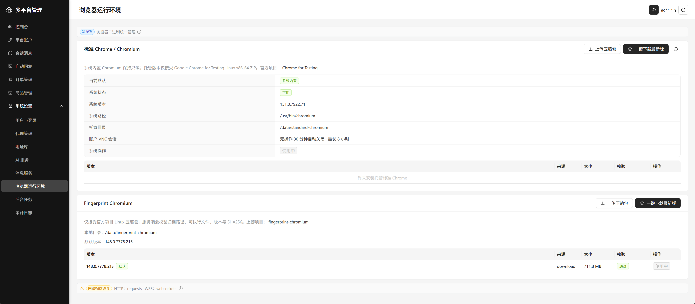

### 7.2 代理管理

进入“系统设置 → 代理管理”，新增代理节点并执行连通性测试。确认代理协议、出口 IP、响应时间和启用状态正确后，再绑定平台账户。

系统只支持 `socks5/socks5h`。账户操作链路、VNC 和相关 HTTP 请求都使用绑定代理，失败时不允许切换为直连。

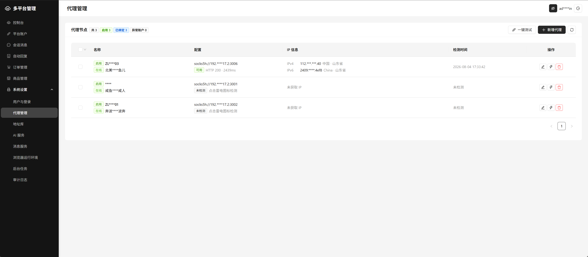

### 7.3 平台账户

进入“平台账户”新增或编辑账户，确认 Cookie、在线状态、代理环境、备注及会话、商品、订单等业务开关。

页面效果见文档开头的[功能预览](#平台账户)。

### 7.4 浏览器与指纹

编辑账户时，在“浏览器与指纹”中配置内核、平台、稳定 Seed、浏览器语言、请求语言、时区、WebRTC 和各指纹模块。

同一账户应保持稳定的浏览器身份配置；重新生成 Seed 会改变账户指纹。Fingerprint Chromium、VNC 和 HTTP 操作需要保持一致。

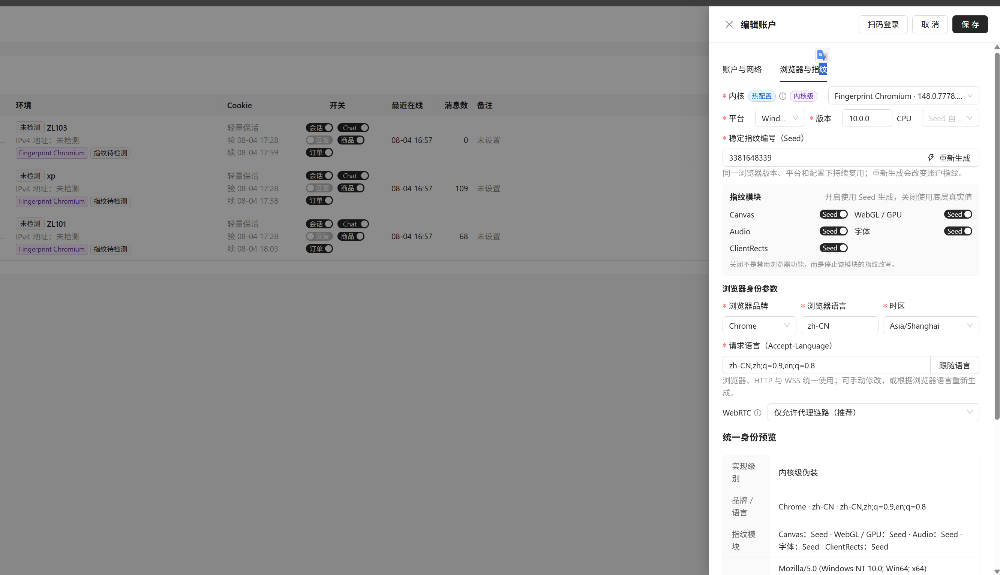

### 7.5 VNC 浏览器会话

账户配置完成后打开 VNC 浏览器，检查账户代理、Cookie、指纹基线和安全状态，再完成平台登录或人工验证。

打开 VNC 时系统自动同步并注入 Cookie，关闭时自动提取 Cookie。结束操作后应正常关闭会话，避免残留无效进程。

页面效果见文档开头的[功能预览](#vnc-浏览器会话)。

## 8. 功能使用

### 8.1 会话消息

会话消息页面聚合多个账户的客户消息、商品和会话状态。默认展示全部消息，最新消息优先，未读消息优先，并支持发送文字或图片。

页面效果见文档开头的[功能预览](#会话消息)。

### 8.2 Chatwoot 消息同步

系统支持平台级 Chatwoot 双向同步、账户独立 Inbox、移动端分组和账户状态提醒，可在桌面端或移动端处理会话。

桌面端效果见文档开头的[功能预览](#chatwoot-消息同步)，移动端效果如下。

| 移动端收件箱 | 移动端会话列表 | 移动端会话 |
| --- | --- | --- |
| 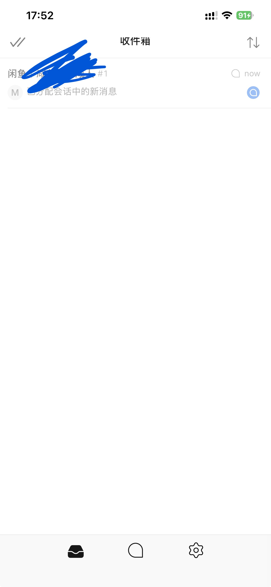 | 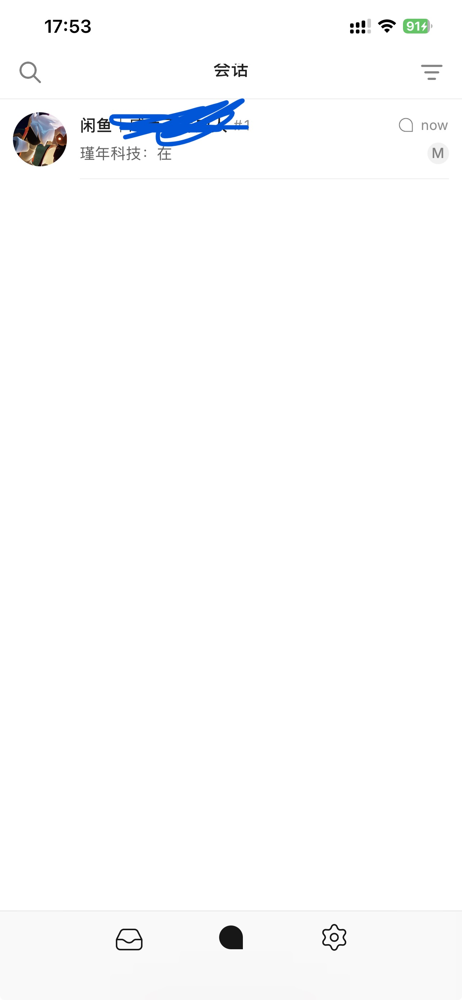 | 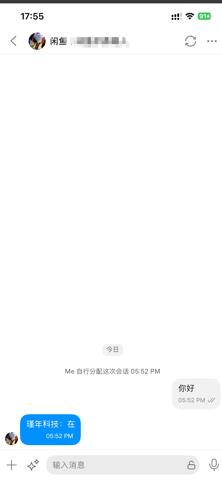 |

### 8.3 商品发布

商品发布页面用于填写标题、描述、价格、原价、库存、类目提示、运费、所在地和商品图片。目前仅支持基础参数，完整参数和自动发布执行器仍待完成。

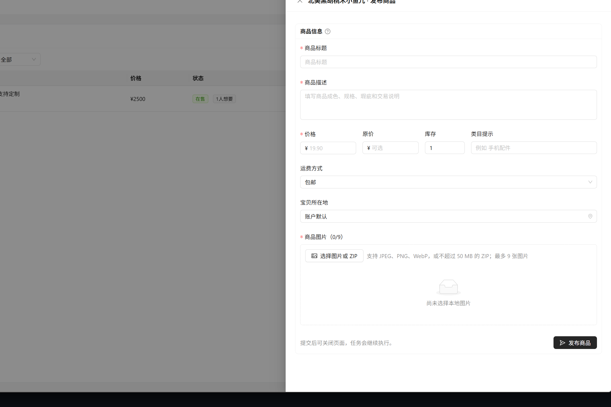

### 8.4 其他模块

- 自动回复：关键词规则、默认回复、OpenAI 兼容接口、上下文窗口和人工接管。
- 订单管理：查看订单状态和被动获取的订单信息。
- 商品管理：维护商品及发布状态。
- 地址库：管理业务地址。
- AI 服务：配置兼容接口及调用参数。
- 消息服务：管理 Chatwoot 等消息通道。
- 后台任务：查看 Redis 队列和任务执行状态。
- 审计日志：追踪写操作及关键配置变更。

## 9. 项目状态与当前目标

### 9.1 已完成

- 平台账户管理和 WSS 长连接。
- 账户级 `socks5h` 代理隔离，覆盖账户操作、VNC 和相关请求链路，无直连兜底。
- VNC 在线操作、安全验证和 Cookie 自动注入/提取同步。
- Fingerprint Chromium 接入、VNC 指纹绑定和 HTTP 操作指纹同步。
- Chatwoot 接入和多端消息同步。

### 9.2 当前目标

- 多后台用户：用户名/密码登录、JWT 鉴权和用户管理页面。
- 多闲鱼账户：账户增删改查、启停、会话和消息管理。
- 闲鱼扫码登录：服务端维护扫码会话并保存 Cookie，浏览器不接触登录凭据。
- IM 安全验证：单浏览器环境、账户级 Profile、绑定代理和内嵌 noVNC 人工处理；风险态不自动重试。
- 平台账户浏览器：按需启停 VNC，复用 Cookie、代理和 Profile，提供仅本机可访问的 CDP，并支持安全清理 Profile。
- S5 代理池：节点增删改查、出站测试和账号绑定。
- 自动回复：关键词、默认回复、OpenAI 兼容接口、上下文窗口和人工接管。
- 消息服务：Chatwoot 双向同步、账户独立 Inbox、移动端分组和账户状态提醒。
- 队列：Redis 传递 `task_id`，数据库保存任务 payload、状态和结果。
- 登录页：显示当前访问 IP，并解析 CDN 或反向代理来源头。
- 权限：`admin` 全权限、`operator` 业务读写、`viewer` 只读；写操作进入审计日志。

### 9.3 待完善

- 自动回复功能。
- 可以接收语音消息，但发送语音仍待完善。
- 订单管理主动获取链路；当前只有聊天界面的被动获取。
- 商品发布完整参数；当前只有基础参数。
- 平台确认发货接口。
- 闲鱼商品自动发布执行器；完成前不在导航中展示产品发布入口。
- 代理节点批量导入和批量分配。

## 10. 配置与发布说明

### 10.1 配置文件

| 文件 | 用途 |
| --- | --- |
| `.env.example` | 源码启动模板，仅外部 PostgreSQL、Redis 两项人工必填 |
| `.env.docker.example` | Docker 外部 PostgreSQL、Redis 模板，同样只有两项必填 |
| `.env.local` | 源码模式私有配置，不得提交 |
| `.env.docker` | Docker 模式私有配置，不得提交 |
| `compose.yml` | 仅启动项目容器，连接外部 PostgreSQL/Redis |
| `compose.all.yml` | 官方依赖与项目的一键部署定义，由 `开始部署.sh` 管理，无需手工填写 ENV |

全部参数的中文分类、默认值和风险说明见项目源码中的 `docs/configuration.md`。

### 10.2 GitLab 流水线与镜像

- `main` 分支自动执行验证、镜像发布和镜像包归档。
- 其他分支和 Git Tag 只运行验证，不显示发布任务。
- Registry 中的应用镜像同时发布 `latest`。
- 镜像包及 SHA-256 校验文件保留 14 天。
- 本地镜像导入、证书、数据目录和 Docker Compose 细节见 `docs/packaging.md`。

### 10.3 上游约束

`third_party/XianYuApis` 作为独立上游目录保留，不直接修改。项目自有适配层放在 `integrations/xianyu_core`。

## 11. 运维说明

### 11.1 手动 Compose 服务管理

查看状态：

```bash
docker compose --env-file .env.docker ps
```

查看日志：

```bash
docker compose --env-file .env.docker logs -f --tail=200
```

重启：

```bash
docker compose --env-file .env.docker restart
```

停止：

```bash
docker compose --env-file .env.docker down
```

重新启动：

```bash
docker compose --env-file .env.docker up -d --wait --remove-orphans
```

完整一键部署环境优先通过 `开始部署.sh` 的菜单管理，避免绕过脚本造成配置状态不一致。

### 11.2 升级

1. 备份数据库和 `XIANYU_DATA`。
2. 从 `main` 流水线取得新版本镜像包和 SHA-256 文件。
3. 将新包与 `开始部署.sh`、`compose.all.yml` 放在同一部署目录。
4. 执行 `./开始部署.sh --doctor`。
5. 执行 `./开始部署.sh` 并选择升级或开始/继续部署。
6. 完成第 6 章中的关键验证。

升级不会覆盖 `XIANYU_DATA` 中的数据、密钥、证书和配置，但升级前仍必须创建独立备份。

### 11.3 备份

至少备份：

- PostgreSQL 数据库
- `XIANYU_DATA`
- `.env.local` 或 `.env.docker`
- 用户上传文件
- 证书和反向代理配置
- 当前使用的项目镜像版本信息

备份应存放在独立位置，并定期验证能够恢复。

### 11.4 日志排查重点

- 数据库、Redis 和 worker 连接错误
- 数据库迁移失败
- WSS、WebSocket、Chatwoot 或 VNC 连接异常
- Chromium 启动、系统库和 Profile 错误
- 代理检测失败或请求超时
- Cookie 过期、注入或同步失败
- 后台任务积压或重复失败

### 11.5 回滚

升级前保留上一版本镜像、数据库备份和 `XIANYU_DATA` 副本。回滚时恢复相互匹配的镜像、配置和数据库版本，重新启动服务后再执行第 6 章验证。

## 12. 常见问题

### 12.1 `开始部署.sh` 找不到或无法执行

```bash
pwd
ls -l
chmod +x ./开始部署.sh
./开始部署.sh --doctor
```

确认四个部署文件位于同一目录，并检查脚本换行格式、执行权限及镜像包名称。

### 12.2 镜像校验或导入失败

- 确认镜像包与 `.sha256` 来自同一次流水线。
- 检查文件名、文件大小和剩余磁盘空间。
- 确认 Docker 平台为 Linux `amd64`。
- 重新执行 `./开始部署.sh --doctor` 查看具体阶段。

### 12.3 浏览器环境不可用

- 检查浏览器版本、安装路径和校验结果。
- 检查运行用户是否具有浏览器目录的读写和执行权限。
- 检查图形环境、字体、共享内存和系统库。
- 检查磁盘空间及浏览器 Profile 目录权限。

### 12.4 代理检测失败

- 检查代理是否为受支持的 `socks5/socks5h`。
- 检查地址、端口和认证信息。
- 检查服务器防火墙及出口网络。
- 确认代理服务允许当前服务器连接。
- 不要通过直连绕过失败代理。

### 12.5 平台账户离线

- 检查 Cookie 是否过期。
- 检查绑定代理是否可用。
- 检查账户指纹或 Profile 是否被意外修改。
- 通过 VNC 重新登录并确认平台安全验证状态。

### 12.6 VNC 或 WebSocket 无法连接

- 检查浏览器服务和会话进程。
- 检查反向代理是否正确转发 WebSocket 升级头。
- 检查代理超时、HTTPS 和防火墙端口。
- 查看 VNC、浏览器、Chatwoot 和后端日志。

### 12.7 Chatwoot 不同步消息

- 检查 Chatwoot Rails、Sidekiq、PostgreSQL 和 Redis 状态。
- 检查平台账户对应 Inbox 和消息通道配置。
- 检查 WSS 连接、worker 队列和任务结果。
- 确认桌面端与移动端登录的是同一 Chatwoot 工作区。


# 感谢来自上游项目参考
- https://github.com/cv-cat/XianYuApis